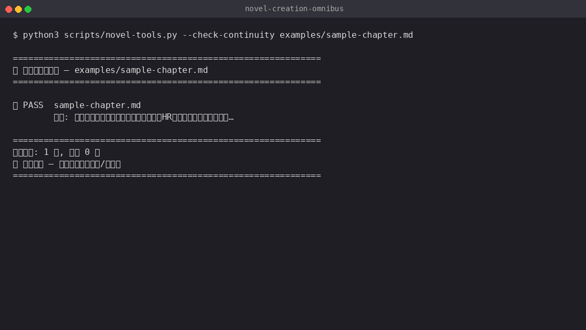

<div align="center">

# 🖋️ 小说创作全能工坊 v5.9

> *「写小说最难的不是写，是写完不烂尾、不水、不带AI味。」*

[](SKILL.md)
[](https://skills.sh/limingnanyue/novel-creation-omnibus)
[](LICENSE)
[](references/modules/)
[](references/modules/anti-ai-polish.md)

**从0到完本，40套工具按需加载——长篇网文、短篇虐文、番茄爆文、白描克制，一个工坊搞定。**

[看效果](#效果示例) · [安装](#快速开始) · [触发方式](#触发方式) · [40个模块](#40个模块按需加载) · [它和同类有什么不同](#它和同类有什么不同) · [安全边界](#安全边界) · [验证与测试](#验证与测试)

</div>

---

## 效果示例



> 上图为脚本真实运行录屏（3帧循环）。完整章节示例见 [examples/sample-chapter.md](examples/sample-chapter.md)，工具输出见 [examples/demo-output.md](examples/demo-output.md)。

**输入：** "写番茄爆文第一章。主角：被裁员的中年程序员，回家路上发现世界变了"

**输出节选：**

```
标题：《刚被裁，全人类进了数据副本》

第一章

手机震了三下。

陈默看了一眼手机，是HR发来的离职证明。他锁屏，把手机塞回口袋。

今天第三家公司了。

三个月，投了76份简历，面试23家，全部卡在「年龄超35岁」这一条上。
```

<sub>↑ 300字内入题，短句口语化，无AI味禁用词，章首不用时间词——符合 core-writing 铁律</sub>

---

## 快速开始

```bash
# 一行安装
npx skills add limingnanyue/novel-creation-omnibus -g
```

装完直接对 Agent 说：

```text
写小说
```

## 触发方式

| 你想做什么 | 对 Agent 说 |
|:-----------|:----------|
| 写正文 | "写第X章，接上章结尾" |
| 搭世界观 | "搭一个修仙世界的世界观" |
| 做人设 | "设计一个反派" |
| 写对话 | "帮我优化这段对话，加潜台词" |
| 开篇钩子 | "帮我写个第一章开头，要抓人" |
| 去AI味 | "去AI味，我是用Claude写的" |
| 写短篇 | "写个短篇BE，3000字" |
| 规则怪谈 | "写个规则怪谈，办公室题材" |
| 模型优化 | "针对DeepSeek优化我的写作策略" |
| 读者心理 | "分析我这章的读者留存问题" |
| 断更重启 | "好久没写了，帮我恢复" |
| 动作描写 | "帮我写一段打斗，三拍式节奏" |
| 多线叙事 | "帮我设计三条线的交织节奏" |
| 世界体系 | "设计一个修仙力量体系" |
| 修改初稿 | "帮我改一下这章，4层流程" |
| 氛围渲染 | "这一段要压抑氛围" |
| 市场分析 | "这个题材选哪个平台好" |

完整触发词列表见 [SKILL.md](SKILL.md) 路由表。

## 你什么时候需要它？

- **写长篇网文**：日更2000-2500字/章，章章有钩子，自动追踪状态
- **写番茄爆文**：标题公式+导语模板+八步法+数据评级+系统流特化
- **写黄金开头**：12种爆款开篇+300字生死线自检+章末钩子4型
- **写对话**：语速4档+潜台词3级+声线5维+群像管理+AI对话修正
- **写虐心BE**：六大原型痛觉+刀力评分+三段式通感递进+开放式BE
- **去AI味**：六大门禁+三刀流+八类必查+**模型感知去AI味**（6大模型各有策略）
- **写规则怪谈/无限流/直播文/末世/悬疑/种田**：各题材独立模板
- **断更重启**：4步恢复上下文+连载管理策略+读者留存方案
- **针对不同模型优化写作**：Claude/DeepSeek/GPT/Qwen/Kimi/豆包各分支策略
- **让文字更有味道**：五感缺失检测+口语化六法+小动作体系+食物描写
- **设计人物弧光**：正向弧7阶段+负向弧5阶段+关系弧+多人物弧交织
- **管理长篇连载**：存稿策略+滚动大纲+断更恢复4步+读者留存策略
- **适配平台规则**：起点/飞卢/晋江三大平台写作标准+签约门槛+跨平台改编
- **设计情绪高潮**：燃/泪/甜/震四类高潮+七步结构+长篇高潮规划
- **生成创作灵感**：8种灵感生成法+30个情节模板+灵感仓库管理
- **理解读者心理**：情绪闭环+代入感三要素+弃书TOP10对策+情绪仪表盘
- **写动作/环境/外貌/战斗**：三拍式动作节奏+环境五感矩阵+战斗三秒规则+细节具象化
- **多线叙事**：POV切换策略+多线交织3种结构+时间锚点+线索铺设回收
- **控制节奏**：快慢交替公式+情节密度曲线+读者疲劳管理+长短章交替
- **设计世界体系**：力量等级+经济系统+政治格局+社会阶层+组织设计
- **修改工作流**：4层修改(结构→章节→句子→校对)+打乱重排+七刀精修
- **管理副线**：四大副线类型+主副线比例+收束时机+支线轮换
- **渲染氛围**：五种基础氛围+构建三阶段+三叠法+氛围反转
- **市场战略**：平台分析+读者画像+差异化定位+竞争分析+IP评估

## 它会交付什么？

- ✅ **完整的章节正文**（长篇2000-2500字/番茄爽文1200-1500字）
- ✅ **AI味检测报告**（禁用词密度+修正对比+**模型专属修正**）
- ✅ **状态追踪档案**（人物位置/伤势/好感度/伏笔/情绪曲线）
- ✅ **因果链分析报告**（起因→因果链→人物信息差→章节功能）
- ✅ **刀力评分**（6大痛觉原型+通感四式/剂量管控/三段式递进）
- ✅ **对话声线档案**（每个角色专属说话方式+潜台词设计）
- ✅ **场景卡片**（目标/冲突/变化/进出/衔接一致性检查）
- ✅ **人物弧光规划**（起点→关键转折→终点的变化路径）
- ✅ **描写提升报告**（动作/环境/外貌/战斗等维度改进建议）
- ✅ **节奏分析**（密度曲线+疲劳点+长短章优化建议）
- ✅ **修改审计**（修改层次/删除比例/读者反馈整合状态）

## 40个模块，按需加载

| 模块 | 说明 |
|:-----|:-----|
| `core-writing` | 长篇正文6步流程 |
| `planning` | 大纲模板+细纲+9维全检 |
| `world-characters` | 世界观+人物五维+群像引擎 |
| `short-stories` | 短篇字数结构+结尾七选一 |
| `angst-writing` | 日常化死亡+刀力评分 |
| `memes-trends` | 玩梗六类+热梗仓库 |
| `anti-ai-polish` | 六门禁+模型感知去AI味 |
| `transitions-causality` | 衔接修复+因果链 |
| `state-tracking` | 记忆台账+伏笔管理 |
| `quality-control` | 三层质检 |
| `fan-fiction` | 同人六阶段+OOC量化 |
| `production-line` | 14节点生产+锁稿 |
| `adaptive-scheduling` | 三档切换+仪表盘 |
| `viral-writing` | 番茄爆文八步法+数据评级 |
| `restrained-writing` | 白描双线叙事+平庸现实 |
| `golden-three` | 黄金三章标准+完读率 |
| `conflict-fusion` | 跨规则裁决+三法融合 |
| `pain-synaesthesia` | 通感四式+六大原型（900行） |
| `model-optimization` | **6大模型分支策略** |
| `new-genres` | **规则怪谈/无限流/直播/末世/悬疑/种田** |
| `flavorful-writing` | **五感+口语化+小动作+食物** |
| `dialogue-mastery` | **对话8大功能+声线5维+潜台词** |
| `opening-hooks` | **12种爆款开篇+章末钩子4型** |
| `plot-engineering` | **番茄循环+反转7式+冲突6级** |
| `reader-psychology` | **情绪闭环+弃书TOP10对策** |
| `scene-crafting` | **场景四要素+6大场景类型+衔接** |
| `character-arcing` | **正向弧7阶段+负向弧+关系弧** |
| `serial-management` | **存稿策略+断更恢复+读者留存** |
| `platform-rules` | **起点/飞卢/晋江三大平台规则** |
| `emotional-climax` | **燃/泪/甜/震四类高潮+七步结构** |
| `idea-generator` | **8种灵感法+30个情节模板** |
| `descriptive-craft` | **描写技法🆕：动作三拍/环境五感/战斗三秒** |
| `narrative-weaving` | **多线叙事🆕：POV切换/三结构/线索铺设** |
| `pacing-dynamics` | **节奏动力学🆕：密度曲线/疲劳管理/长短章交替** |
| `world-systems` | **世界运转体系🆕：力量等级/经济/政治/社会** |
| `revision-workflow` | **修改工作流🆕：4层修改/重排法/七刀精修** |
| `subplot-craft` | **副线编织法🆕：四大副线/主副比例/收束时机** |
| `atmosphere-mood` | **氛围渲染术🆕：五种氛围/三叠法/反转手法** |
| `market-strategy` | **市场战略🆕：平台分析/读者画像/IP评估** |

## 它和同类有什么不同？

| 维度 | 其他写作Skill | **本工坊 v5.9** |
|:-----|:-------------|:----------------|
| 模块数 | 1-10个 | **40个**，覆盖写作全流程 |
| 去AI味 | 简单禁用词替换 | 六门禁+三刀流+**模型感知去AI味** |
| 模型适配 | 无 | **6大模型**各有专属策略和负面提示 |
| 通感痛觉 | 无 | 900行通感体系（六大原型+四式+剂量管控） |
| 题材覆盖 | 1-3种 | **12+题材**含规则怪谈/无限流/直播等新锐 |
| AI对话修正 | 无 | 6大AI对话通病+各模型修正速查 |
| 读者心理 | 无 | 情绪闭环+代入感+爽点/虐点公式 |
| 人物弧光 | 无 | 正向/负向/关系/多人物弧交织 |
| 连载管理 | 无 | 存稿+断更恢复+读者留存 |
| 描写技法 | 无 | **动作三拍/环境五感/战斗三秒规则** |
| 多线叙事 | 无 | **POV切换规范/线索铺设回收体系** |
| 节奏控制 | 无 | **密度曲线/疲劳管理数学模型** |
| 世界体系 | 无 | **力量等级/经济系统/社会阶层** |
| 修改流程 | 无 | **4层结构修改/打乱重排法** |
| 副线管理 | 无 | **四大副线类型/主副线比例公式** |
| 氛围渲染 | 无 | **五种基础氛围/三叠法/反转构建** |
| 市场战略 | 无 | **平台分析/读者画像/IP评估** |
| 质量门控 | 写完了事 | 写→审→改→检→锁稿5阶段闭环 |
| 架构 | 单文件巨无霸 | **模块化路由**：按需加载，token友好 |

## 安全边界

- ❌ 不会自动修改你的细纲/大纲/人设文件
- ❌ 不会在不确认的情况下删除任何内容
- ❌ 不会把小说内容写入公开文件
- ✅ 每次写正文前都会读取最新状态文件
- ✅ 所有关键决策等你确认

## 验证与测试

本仓库含 16 个测试用例（[examples/test-prompts.json](examples/test-prompts.json)），覆盖全部 40 个模块。

**验收命令——章首连续性检查（core-writing 铁律）：**

```bash
# 检查章首是否误用禁用时间词（第二天/次日/翌日…）
python3 scripts/novel-tools.py --check-continuity your-chapters/
```

**验收命令——字数与AI味分析：**

```bash
# 单章分析（对话占比/AI味密度/段落分布）
python3 scripts/word-count-tool.py chapter-01.md

# 目录批量分析 + 综合评级
python3 scripts/word-count-tool.py chapters/

# JSON 结构化导出（供 CI/流水线集成）
python3 scripts/word-count-tool.py --json chapters/
```

## 文件结构

```
novel-creation-omnibus/
├── SKILL.md                          # 主路由（任务调度+模块索引+冲突裁决）
├── README.md                         # 安装说明与展示
├── CHANGELOG.md                      # 版本更新记录
├── LICENSE                           # MIT
├── examples/
│   ├── test-prompts.json             # 16个测试用例
│   ├── demo-output.md                # 真实输出示例
│   └── sample-chapter.md             # 真实示例章节（约2000字，供工具分析）
├── assets/
│   ├── demo.gif                      # 终端运行录屏（3帧循环）
│   └── demo.tape                     # vhs 录制脚本（可复现）
├── scripts/
│   ├── novel-tools.py                # 章节验证/字数统计/大纲生成/连续性检查
│   ├── word-count-tool.py            # 字数统计与AI味分析（含JSON导出）
│   ├── check-skill-repo.sh           # 发布就绪度自检（鲁班结构尺）
│   ├── gen-demo-gif.py               # 生成 demo.gif 的脚本
│   └── install.sh                    # 一键安装脚本（含验证）
└── references/modules/               # 40个模块，按需加载
    ├── core-writing.md               # 长篇正文写作
    └── ...                           # 完整列表见 SKILL.md
```

## 版本历史

| 版本 | 亮点 |
|:-----|:------|
| **v5.9.4** | 🔧 自托管体检脚本 + demo.gif录屏 + 真实示例章节 + install.sh验证（check全绿14/0/0） |
| **v5.9.3** | 🔧 鲁班house-style对齐 + marketplace标准格式 + skills.sh徽章 + 验证测试节 |
| **v5.9.2** | 🔧 脚本升级：章首连续性检查 + JSON结构化导出 + 测试用例翻倍(8→16) + 鲁班框架对齐 |
| **v5.9** | 🆕 描写技法 + 多线叙事 + 节奏动力学 + 世界体系 + 修改工作流 + 副线编织法 + 氛围渲染术 + 市场战略 |
| **v5.8** | 🆕 情绪高潮设计(燃/泪/甜/震) + 灵感生成器(8法+30模板) |
| **v5.7** | 🆕 平台规则(起点/飞卢/晋江) + 字数统计工具 |
| **v5.6** | 🆕 场景写作 + 人物弧光 + 长篇连载管理 |
| **v5.5** | 🆕 对话大师 + 开篇钩子 + 情节工程 + 读者心理 |
| **v5.4** | 🆕 模型优化 + 新题材 + 风味写作 + AI味模型感知 |
| **v5.3** | 模块化重构：2540行→模块化，首版发布 |

## 致谢

- 鲁班 | Luban 打磨框架：https://github.com/LearnPrompt/luban-skill
- 持续迭代于 Hermes Agent 环境

## License

[MIT](LICENSE)

---

<div align="center">

*写小说，一个工坊就够了。*

</div>
